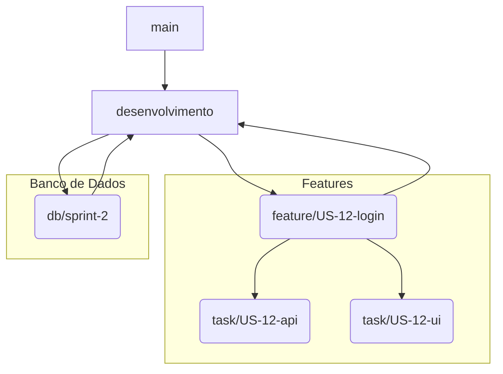

# 📌 Guia Completo de Contribuição

Bem-vindo ao repositório\! Este documento define as regras obrigatórias para contribuir com o projeto, garantindo **organização, rastreabilidade e padronização**.

> **Nota:** Commits e Pull Requests que não seguirem este guia serão rejeitados.

-----

## 📜 Sumário

  - [🔹 Estrutura de Branches](https://www.google.com/search?q=%23-estrutura-de-branches)
  - [🔹 Padrão de Commits](https://www.google.com/search?q=%23-padr%C3%A3o-de-commits)
  - [🔹 Banco de Dados](https://www.google.com/search?q=%23-banco-de-dados)
  - [🔹 Pull Requests](https://www.google.com/search?q=%23-pull-requests)
  - [✅ Checklist Pré-Commit](https://www.google.com/search?q=%23-checklist-pr%C3%A9-commit)
  - [🔹 Exemplo Visual do Fluxo](https://www.google.com/search?q=%23-exemplo-visual-do-fluxo)
  - [📎 Templates Recomendados](https://www.google.com/search?q=%23-templates-recomendados)

-----

## 🔹 Estrutura de Branches

Adotamos uma variação do **GitFlow**, com regras específicas para nossa equipe.

### Fluxo Principal

  - `main` → Código estável em produção.
  - `desenvolvimento` → Integração da sprint.

### Fluxo de Desenvolvimento

  - `feature/US-<id>-<nome>` → Cada User Story tem sua branch.
  - `task/US-<id>-<descrição>` → Subtasks técnicas (opcional).
  - `db/sprint-<número>` → Alterações de banco de dados da sprint.

### Exemplo de Árvore de Branches



-----

## 🔹 Padrão de Commits

Seguimos esse padrão de commits:

```text
<tipo>(US-<id>): <descrição curta>
```

### Tipos Aceitos

| Tipo     | Descrição                                 |
| :------- | :---------------------------------------- |
| `feat`   | Nova funcionalidade                       |
| `fix`    | Correção de bug                           |
| `chore`  | Manutenção, configuração ou build         |
| `docs`   | Alterações na documentação                |
| `style`  | Formatação de código (sem alterar lógica) |
| `refactor` | Refatoração de código                     |
| `test`   | Adição ou refatoração de testes           |

### Exemplos

```text
feat(US-<id>): criar endpoint de login
feat(US-<id>): adicionar tela de login
chore(db): gerar migração inicial
refactor(US-<id>): extrair lógica de autenticação
fix(US-<id>): corrigir alinhamento do botão de login
```

-----

## 🔹 Banco de Dados

Adotamos a estratégia **Database First**. Todas as alterações de banco de dados devem ser concentradas na branch `db/sprint-<n>`.

### Regras

  - Nenhuma branch de `feature/*` ou `task/*` deve aplicar migrações diretamente.
  - Alterações de schema devem ser documentadas na descrição da US/Task.
  - As migrações são exclusivas da branch `db/sprint-<n>`.
  - Commits podem conter ou não relação com uma User Story.

### Padrão de Commits no Banco

```text
feat(db): criar tabela Clientes

chore(db): adicionar índice na coluna email da tabela Usuarios

refactor(db): normalizar relação Pedidos-Itens
```

-----

## 🔹 Pull Requests

### Regras de PR

  - `feature/*`, `task/*`, `db/*` devem ser direcionados para a branch `develop`.

### Título do PR

  - **User Story:** `[US-<id>] <descrição da US>`
  - **Banco de Dados:** `[DB-Sprint-<n>] <descrição das alterações>`

### Descrição Obrigatória

  - Link da US/Task (Jira, Azure DevOps, etc.).
  - Lista de Alterações.

### Descrição Opcional

  - Checklist de Testes.

-----

## ✅ Checklist Pré-Commit

  - [ ] O nome da branch está correto (`feature/US-123-exemplo`).
  - [ ] Os commits seguem o padrão `tipo(escopo): mensagem`.
  - [ ] O código foi revisado (auto-revisão).
  - [ ] Os testes locais foram executados e aprovados.
  - [ ] As alterações de banco de dados estão documentadas na US/Task.
  - [ ] O PR foi aberto para a branch correta (`Desenvolvimento`).
  - [ ] O título e a descrição do PR foram preenchidos conforme o template.

-----

## 📎 Templates Recomendados

### Commit

```text
<tipo>(US-<id>): <mensagem curta>

<tipo>(not-US): <mensagem curta
```

### Pull Request

**Título:** `[US-<id>] <descrição da US>` ou `[DB-Sprint-<n>] <descrição do DB>`

**Descrição:**

```markdown
**Link da US/Task:**
[Link para a tarefa no Jira/Azure DevOps]

**Alterações realizadas:**
- Implementado o endpoint de autenticação.
- Criada a interface de login.
- Adicionada validação de formulário no frontend.

**Checklist de Testes:**
- [x] Teste unitário do serviço de autenticação.
- [ ] Teste de integração do endpoint `/login`.
- [x] Validação manual do fluxo de login na UI.
```
